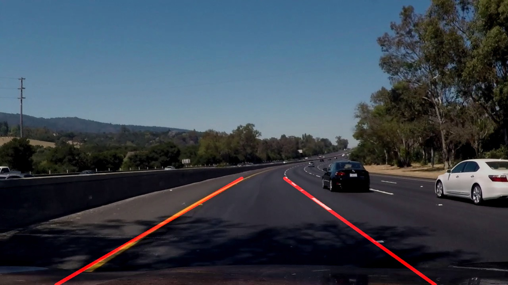

# **Finding Lane Lines on the Road** 

### ***Lane Line Detector Pipeline***
1. **Color Selection**

    Since lane lines in this task are either yellow or white, it's natural to try masking the 
    image by selecting yellow and white pixels. First I tried selecting in RGB space. The code
    is shown below:
    ```python
    def select_rgb_white_yellow(image):
       # white selection
       white_low_threshold = np.uint8([200, 200, 200])
       white_high_threshold = np.uint8([255, 255, 255])
       white_mask = cv2.inRange(image, white_low_threshold, white_high_threshold)   
       # yellow selection
       yellow_low_threshold = np.uint8([150, 150, 0])
       yellow_high_threshold = np.uint8([255, 255, 255])
       yellow_mask = cv2.inRange(image, yellow_low_threshold, yellow_high_threshold)
       # combine the mask
       mask = cv2.bitwise_or(white_mask, yellow_mask)
       result = cv2.bitwise_and(image, image, mask = mask)
       return result
    ```
    However, in this task, selecting white/yellow color in RGB space doesn't lead to good 
    result. So I tried selecting in HSL space (referred to 
    [naokishibuya's code](https://github.com/naokishibuya/car-finding-lane-lines)).
    ```python
    def select_hsl_white_yellow(image):
       #convert to hsl space
       image_convert = cv2.cvtColor(image, cv2.COLOR_RGB2HLS)
       # white selection
       white_low_threshold = np.uint8([  0, 200,   0])
       white_high_threshold = np.uint8([255, 255, 255])
       white_mask = cv2.inRange(image_convert, white_low_threshold, white_high_threshold)   
       # yellow selection
       yellow_low_threshold = np.uint8([10,   0, 100])
       yellow_high_threshold = np.uint8([40, 255, 255])
       yellow_mask = cv2.inRange(image_convert, yellow_low_threshold, yellow_high_threshold)
       # combine the mask
       mask = cv2.bitwise_or(white_mask, yellow_mask)
       result = cv2.bitwise_and(image, image, mask = mask)
       return result
    ```
2. **ROI Selection**
    
    For this task, the detected lane lines are mostly located in the central part of the image.
    Therefore, I set the four vertices of the ROI region as below:
    ```python
    top_left = (width /20, height)
    bottom_left = (width * 7/20, height * 4/7)
    bottom_right = (width * 13/20, height * 4/7)
    top_right = (width * 19/20, height)
    ```
    Note that the coordinates of these four vertices are not fixed. That's because the sizes of the
    input images could change. My strategy makes the ROI region always located in the center of 
    images.

3. **Canny Edge Detection**

    After color and ROI selection, I use Canny edge detection to draw out edges in the images.
    The edge detection consists of three steps:
    * Transfer the RGB image to grayscale by using `cv2.cvtColor`.
    * Smooth rough edges by using `cv2.GaussianBlur`.
    * Use `cv2.Canny` to detect the edges in input images.
    The kernel size I used for GaussianBlur is 7, and `low_threshold = 80, high_threshold = 150`
    for the Canny function.

4. **Hough Transform Line Detection**

    With the outputs of Canny edge detection, I use `cv2.HoughLineP` to detect straight lines. I 
    tried different parameters and finally got a set which is best for this task.
    ```python
    rho = 1
    theta = np.pi / 180
    threshold = 15
    min_line_len = 20
    max_line_gap = 300
    ```

5. **Merge Same Lane Segments**
    
    The result of Hough Line detection might consist of multiple left and right lane lines. In order to
    draw a single lane line on the left and right, it's necessary to filter out some false lane lines and
    merge same lane line segments.
    
    The index for filtering false lane lines in this task is the slope of the line. Since no steep turns appeared
    in this task, I presumed that lines whose slope fall into `[-0.3, 0.3]` are invalid lane lines. Results show 
    that this strategy works well for this task.
    
    After getting unpleasant lines out, I averaged the interceptions of valid left and right lane lines with the upper
    and lower bounds of ROI.
    
    `draw_lines()` is modified as follows:
    ```python
    def draw_lines(img, lines, color=[255, 0, 0], thickness=8, top = 540, bottom = 320):
        # Modified to draw out single left and right lane lines
        left_start_x, left_end_x, right_start_x, right_end_x = [], [], [], []
        for line in lines:
            for x1,y1,x2,y2 in line:
                if x1 == x2:  # filter out vertical lines
                    continue
                else:
                    slope = (y1-y2) / (x1-x2)
                    intercept = y1 - slope * x1
                    if slope > 0.2:  # left lane lines
                        start_x = (top - intercept) / slope
                        end_x = (bottom - intercept) / slope
                        left_start_x.append(start_x)
                        left_end_x.append(end_x)
                    elif slope< -0.2:  # right lane lines
                        start_x = (top - intercept) / slope
                        end_x = (bottom - intercept) / slope
                        right_start_x.append(start_x)
                        right_end_x.append(end_x)
                    else:
                        continue   # filter out lines with small slope
        merged_lines = []
        merged_lines.append([(int(np.mean(left_start_x)), top, 
                              int(np.mean(left_end_x)), bottom)])
        merged_lines.append([(int(np.mean(right_start_x)), top, 
                              int(np.mean(right_end_x)), bottom)])
        
        for line in merged_lines:
            for x1,y1,x2,y2 in line:
                cv2.line(img, (x1,y1), (x2,y2), color, thickness)
    ```

6. **Final output**
    
    The final step is just masking the original image with the detected lane line results.
    
    


### ***Potential shortcomings***

The potential shortcomings includes:
    
* This method can only detect straight lines, which is useful when the car is driving in
a straight road. Therefore, when we encounter a steep turn or sharp curve, this method may fail.
* This method is available only when the lane lines clear on the road. So in situations where
the lane lines are unclear (e.g. in the dark night or in crowed city street where the lane lines 
are blocked by other vehicle), this method could be ineffective.
* This method assumes that the car was always driving between two lane lines, so that the ROI
region should locate in the center image. However, this assumption could be easily chanllenged 
when the car is changing lanes. Thus, in situations like changing lanes, lane lines outside the ROI
region couldn't be detected.

### ***Possible improvements***

Possible improvements would be to develop a method that can detect curved lane lines. Besides,
with the development of deep neural networks, we can also use CNNs to do some detection or 
semantic segmentation task, which might greatly improve the ability of this lane line detection
method. 
